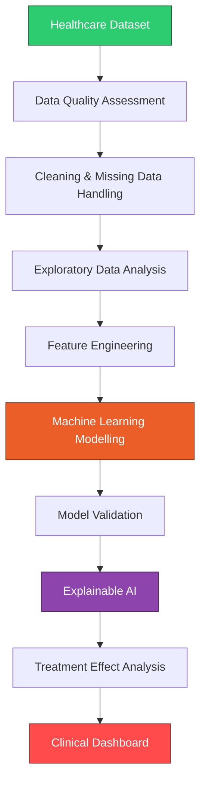

<div align="center">

# 🩺 Diabetes Risk Prediction & Treatment Effect Analytics

### End-to-End Healthcare Analytics on Real-World Clinical Data

*From raw electronic health records to calibrated, explainable, clinically interpretable risk predictions.*

<br>


</div>

---

## 📌 Table of Contents

1. [Overview](#-overview)
2. [Why This Project Matters](#-why-this-project-matters)
3. [Clinical Scenario](#-clinical-scenario)
4. [Research Questions](#-research-questions)
5. [Dataset](#-dataset)
6. [Project Workflow](#-project-workflow)
7. [Feature Engineering](#-feature-engineering)
8. [Machine Learning Models](#-machine-learning-models)
9. [Model Evaluation](#-model-evaluation)
10. [Explainable AI](#-explainable-ai-shap)
11. [Clinical Decision Support](#-clinical-decision-support)
12. [Treatment Effect Analysis](#-treatment-effect-analysis)
13. [SQL Healthcare Database](#-sql-healthcare-database)
14. [Interactive Dashboard](#-interactive-clinical-dashboard)
15. [Tech Stack](#-tech-stack)
16. [Repository Structure](#-repository-structure)
17. [Getting Started](#-getting-started)
18. [Roadmap](#-roadmap)
19. [Skills Demonstrated](#-skills-demonstrated)
20. [Author](#-author)
21. [License](#-license)

---

## 🔍 Overview

Diabetes is a major global health challenge linked to cardiovascular disease, hospitalisation, kidney complications and reduced quality of life. As electronic health records (EHRs) and population health datasets grow, computational methods can support **early risk identification**, **personalised treatment strategies** and **evidence-based clinical decision-making**.

This project delivers a **complete healthcare analytics pipeline** that investigates metabolic risk factors, predicts diabetes-related complications and evaluates treatment outcomes using real-world data. It mirrors a genuine clinical research workflow, from data quality assessment through to an interactive decision-support dashboard.

> 🎯 **Goal:** Show how computational methods translate complex healthcare datasets into insights a clinician can actually read, trust and act on.

---

## 💡 Why This Project Matters

| Challenge | This Project's Response |
| :-- | :-- |
| Risk is often spotted too late | Predictive models flag high-risk patients early |
| "Black box" models are hard to trust | SHAP makes every prediction explainable |
| Predicted probabilities can be unreliable | Calibration analysis checks real-world reliability |
| Treatment decisions need evidence | Real-world evidence methods compare therapy groups |
| Insights get stuck in notebooks | A Streamlit dashboard puts them in front of users |

---

## 🏥 Clinical Scenario

A healthcare research team holds a large dataset of demographics, clinical measurements, lifestyle factors and treatment history for people living with diabetes. They want to answer four questions:

- **🔴 Risk Prediction** — which patients are at increased risk of complications?
- **🟠 Patient Stratification** — can patients be grouped by metabolic risk profile for personalised care?
- **🟢 Treatment Evaluation** — do specific therapies change outcomes versus similar untreated patients?
- **🔵 Clinical Interpretation** — which characteristics drive predicted risk?

---

## ❓ Research Questions

### Primary
> Can machine learning models accurately predict diabetes-related adverse outcomes using routinely collected clinical variables?

### Secondary
- Which clinical features are associated with increased diabetes risk?
- How well do different machine learning algorithms perform?
- Are predictions clinically reliable after calibration?
- What factors influence individual patient risk predictions?
- Can observational methods identify differences between treatment groups?

---

## 📊 Dataset

Built on publicly available, real-world clinical datasets:

- **CDC Diabetes Health Indicators Dataset**
- **Diabetes 130-US Hospitals Dataset**

<details>
<summary><b>📁 Click to view variable categories</b></summary>

<br>

| Category | Variables |
| :-- | :-- |
| 👤 Demographics | Age, Sex |
| ⚖️ Anthropometry | BMI |
| 🩸 Clinical measurements | Blood pressure, cholesterol |
| 🏃 Lifestyle | Smoking, physical activity |
| 🫀 Disease history | Cardiovascular disease, stroke |
| 🔬 Metabolic indicators | Diabetes status, glucose-related measures |
| 🏨 Healthcare utilisation | Admissions and outcomes |

</details>

---

## 🔄 Project Workflow



---

## 🧬 Feature Engineering

Raw variables are transformed into clinically meaningful indicators:

| Engineered Feature | Description |
| :-- | :-- |
| **BMI Classification** | Normal, Overweight, Obesity |
| **Age Groups** | Young adult, Middle age, Older adult |
| **Cardiometabolic Risk Score** | Composite of BMI, hypertension, cholesterol, smoking and cardiovascular history |
| **Comorbidity Index** | Summarises existing disease burden |

**Pre-processing pipeline:** data validation, duplicate removal, missing-data assessment, outlier detection, categorical encoding and feature scaling.

---

## 🤖 Machine Learning Models

Three algorithms are trained and compared:

| Model | Role | Strength |
| :-- | :-- | :-- |
| 📈 **Logistic Regression** | Interpretable baseline | Transparent, clinically familiar |
| 🌲 **Random Forest** | Nonlinear learner | Captures complex variable interactions |
| ⚡ **XGBoost** | High-performance model | Strong accuracy on structured clinical data |

---

## 🎯 Model Evaluation

Every model is judged on clinically relevant metrics, not accuracy alone:

| Metric | Purpose |
| :-- | :-- |
| **ROC-AUC** | Overall discrimination |
| **Sensitivity** | Identify high-risk patients |
| **Specificity** | Reduce false positives |
| **Precision** | Accuracy of positive predictions |
| **Recall** | Detection performance |
| **F1 Score** | Balance of precision and recall |
| **Calibration Curve** | Reliability of predicted probabilities |

---

## 🧠 Explainable AI (SHAP)

Model interpretation uses **SHAP** to identify the clinical variables that most strongly drive diabetes risk predictions, turning a "black box" model into transparent, reviewable output.

**Outputs include:**

- 📊 **SHAP summary plot** showing the direction and magnitude of each feature's effect
- 🏅 **SHAP feature importance** ranking variables by overall contribution
- 🌍 **Global feature ranking** across the full cohort

```
   High BMI  +  Hypertension  +  Previous cardiovascular disease
                          │
                          ▼
              ⚠️  Higher predicted complication risk
```

---

## 🩹 Clinical Decision Support

A **command-line prediction tool** lets a clinician enter patient measurements and receive an instant, structured assessment:

- 🎯 **Risk probability** for diabetes-related complications
- 🏷️ **Risk classification** (for example low, moderate or high)
- 🧾 **Clinical recommendation** aligned to the predicted risk

```bash
$ python src/predict.py

Enter patient measurements:
  Age: 58
  BMI: 33.4
  Blood pressure: high
  Cardiovascular history: yes

────────────────────────────────
  Risk probability   : 0.81
  Risk category      : HIGH
  Recommendation     : Prioritise review and lifestyle
                       intervention; consider specialist
                       referral.
────────────────────────────────
```

This shows how a trained predictive model can be translated into a practical **decision support system** that fits real clinical workflows.

---

## 💊 Treatment Effect Analysis

A **real-world evidence** approach compares treatment groups to move beyond prediction toward causal-style reasoning.

> **Clinical question:** Does exposure to GLP-1 receptor agonist therapy influence diabetes-related outcomes?

```
  Treatment group                    Control group
  GLP-1 therapy        vs            No GLP-1 therapy
```

**Analyses include:** baseline comparison, outcome comparison, risk estimation and confounding assessment. The design draws on **target trial emulation** and **active comparator** principles used in modern pharmacoepidemiology.

---

## 🗄️ SQL Healthcare Database

Patient-level data is stored in **SQLite** and queried for clinical analytics.

```sql
SELECT
    age_group,
    AVG(BMI)        AS mean_bmi,
    AVG(HbA1c)      AS mean_hba1c,
    COUNT(*)        AS n_patients
FROM patients
GROUP BY age_group
ORDER BY mean_hba1c DESC;
```

Analytics cover average HbA1c by age group, patient counts by treatment, high-risk patient identification, disease prevalence and outcome summaries.

---

## 📺 Interactive Clinical Dashboard

A **Streamlit** app brings the whole pipeline together:

| Panel | What It Shows |
| :-- | :-- |
| 🧭 **Population Overview** | Total patients, diabetes prevalence, average BMI, cardiovascular risk distribution |
| 🎛️ **Individual Risk Prediction** | Enter patient characteristics to get a risk probability, risk category and SHAP explanation |
| 📉 **Model Performance** | ROC curve, confusion matrix and calibration plots |
| ⚗️ **Treatment Analysis** | Interactive comparison of treatment groups, characteristics and outcomes |

---

## 🛠️ Tech Stack

<div align="center">

| Layer | Tools |
| :-- | :-- |
| **Languages** | Python, SQL |
| **Data Analysis** | Pandas, NumPy, SciPy |
| **Machine Learning** | Scikit-learn, XGBoost, Random Forest, Logistic Regression |
| **Explainable AI** | SHAP |
| **Statistics** | Risk ratios, odds ratios, regression, calibration analysis |
| **Visualisation** | Matplotlib, Plotly, Streamlit |
| **Reproducibility** | Git, Docker, modular Python pipelines |

</div>

---

## 📂 Repository Structure

```
diabetes-risk-prediction-real-world-data/
│
├── 📁 data          # Raw and processed datasets
├── 📁 dashboard     # Streamlit application
├── 📁 models        # Trained model artefacts
├── 📁 notebooks     # Exploratory and analysis notebooks
├── 📁 reports       # Figures, results and write-ups
├── 📁 sql           # Database schema and queries
├── 📁 src           # Core pipeline modules
├── 📁 tests         # Unit tests
├── 🐳 Dockerfile
├── 📄 requirements.txt
└── 📄 README.md
```

---

## 🚀 Getting Started

### 1. Clone the repository
```bash
git clone https://github.com/username/diabetes-risk-prediction-real-world-data.git
cd diabetes-risk-prediction-real-world-data
```

### 2. Create and activate a virtual environment
```bash
python -m venv diabetes_env
```

**Windows**
```bash
diabetes_env\Scripts\activate
```

**Linux / macOS**
```bash
source diabetes_env/bin/activate
```

### 3. Install dependencies
```bash
pip install -r requirements.txt
```

### 4. Launch the dashboard
```bash
streamlit run dashboard/app.py
```

---

## 🗺️ Roadmap

- [ ] External validation on independent datasets
- [ ] Survival analysis for time-to-event outcomes
- [ ] Bayesian hierarchical modelling
- [ ] Live EHR integration
- [ ] Cloud deployment on AWS
- [ ] Large-scale processing with Spark
- [ ] Federated learning for multi-centre data

---

## 🎓 Skills Demonstrated

`Healthcare Data Science` · `Epidemiological Analysis` · `Clinical Prediction Modelling` · `Real-World Evidence` · `ML Validation & Calibration` · `Explainable AI` · `SQL Analytics` · `Reproducible Research` · `Translating Computation into Clinical Insight`

---

## 👤 Author

**Dr Suhirthakumar Puvanendran**

Bioinformatician | AI Researcher | Data Scientist | Lecturer

**Research interests:** 

Precision Medicine · Healthcare AI · Clinical Data Science · Computational Biology · Predictive Modelling

---

## 📜 License

Developed for **educational and research portfolio purposes**.

<div align="center">

<br>

⭐ *If you find this project useful, consider giving it a star.*

</div>